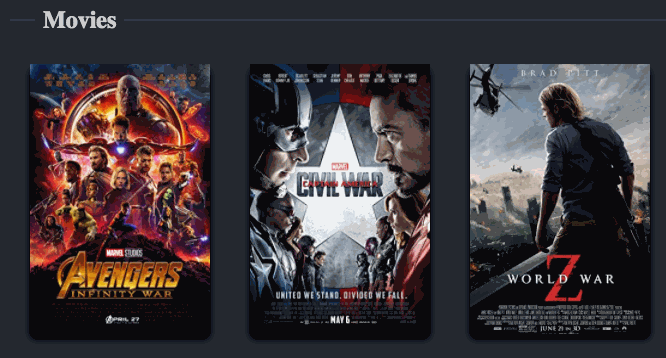

# React Hooks Movies



A cool simple interface for [The Open Movie Database API](http://omdbapi.com/).


[](https://codesandbox.io/s/react-hooks-movies-gm87l?fontsize=14&hidenavigation=1&theme=dark)

## Setup and Run the project

As a prerequisite you must have Node >= 8.10 and npm >= 5.6 installed on your computer.

In the project directory, you can run:

```
npm ci
npm start
```

Open [http://localhost:3000](http://localhost:3000) to view it in the browser.